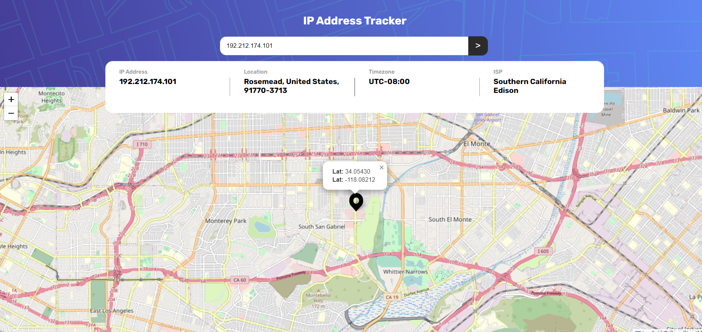
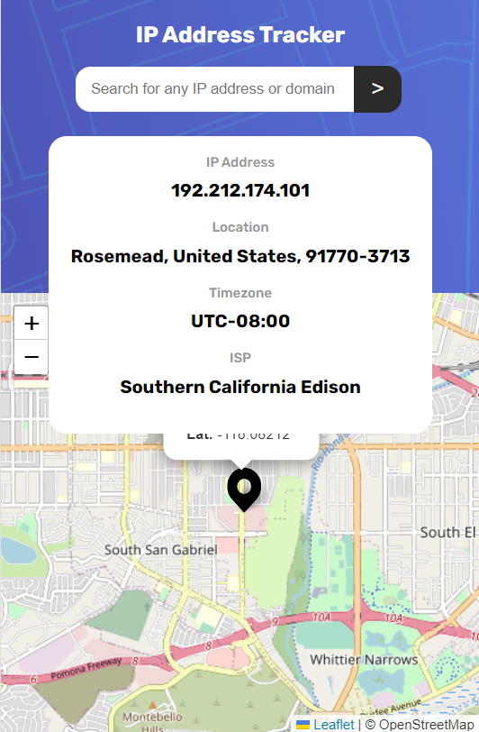

# Frontend Mentor - IP address tracker solution

This is a solution to the [IP address tracker challenge on Frontend Mentor](https://www.frontendmentor.io/challenges/ip-address-tracker-I8-0yYAH0). Frontend Mentor challenges help you improve your coding skills by building realistic projects. 

## Table of contents

  - [The challenge](#the-challenge)
  - [Screenshot](#screenshot)
  - [Links](#links)
- [My process](#my-process)
  - [Built with](#built-with)
  - [What I learned](#what-i-learned)
- [Author](#author)

### The challenge

Users should be able to:

- View the optimal layout for each page depending on their device's screen size
- See hover states for all interactive elements on the page
- See their own IP address on the map on the initial page load
- Search for any IP addresses or domains and see the key information and location

### Screenshot

### Links

- Solution URL: [solution URL ](https://your-solution-url.com)
- Live Site URL: [ live site URL hre](https://your-live-site-url.com)

## My process

### Built with

- Semantic HTML5 markup
- CSS custom properties
- Flexbox

### What I learned

Through the development of this project i practiced especially api integration, but also reaponsive design, and basic concepts of JS like: promises, html elements manipulation and etc.

## Author

- Website - [TBD](https://www.your-site.com)
- Frontend Mentor - [@RibeiroPorto](https://www.frontendmentor.io/profile/RibeiroPorto)
- LinkedIn - [Vinicius Ribeiro](https://www.linkedin.com/in/vinicius-ribeiro-8676b9234/)

